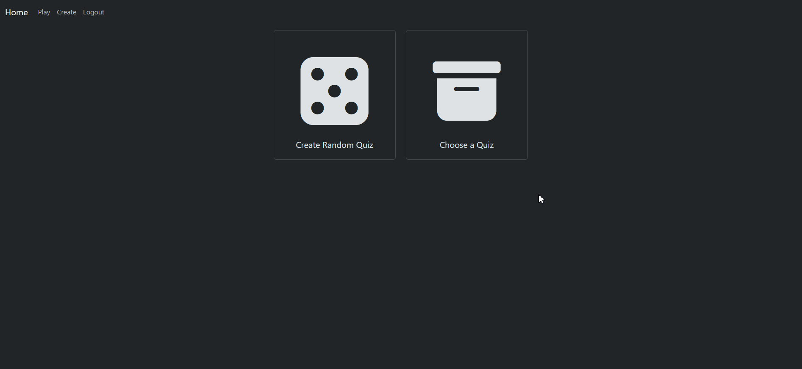

# QuizlyTime - Online Quiz App using React and Flask

## Live App Hosted on render.com
https://quizlytime.onrender.com/quiz
The backend will slow down with inactivity so give it 20-30 seconds to boot up again when you first use the website.

## Creators: 
- [Gowtham Rajendra](https://github.com/GowthamRajendra)
- [Ravi Pogaku](https://github.com/Ravi-Pogaku)

## Table of Contents
- [How to setup with Docker](#how-to-setup-with-docker)
- [How to setup without Docker](#how-to-setup-without-docker)
- [Website Demos](#registerlogin)

## Register/Login
<br>
[Back to Top](#quizlytime---online-quiz-app-using-react-and-flask)

## Play Quiz
<br>

## User Created Quizzes
<br>

## Create Quiz
<br>

## Profile
<br>


## Page Speed Insights
https://pagespeed.web.dev/analysis/https-quizlytime-onrender-com/6ctswqeanh?form_factor=mobile

## How to setup with Docker
1. Pull the main branch
2. create an atlas mongodb cluster. [How to Set Up a Cloud Database (MongoDB Atlas)](#how-to-set-up-cloud-database-mongodb-atlas)
3. create a `.env` file in the root directory of the project and do the following:
    - create a `DB_URI` env variable with a URI to your mongodb cluster
    - create a `JWT_SECRET` env variable with a string. This will be used to generate JWTs so create a secure secret (You could use a uuid creation library).
4. Download and open Docker Desktop, if you don't already have it.
5. In your terminal of choice while in the root directory of the project run the following commands:<br>
```
docker-compose build
```
```
docker-compose up
```
5. The frontend and backend should be up and running. The frontend will be accessible on http://localhost:5173

## How to setup without Docker
1. Pull the main branch
2. create a `.env` file in the root directory of the project and do the following:
    - create a `DB_URI` env variable with a URI to your mongodb cluster
    - create a `JWT_SECRET` env variable with a string. This will be used to generate JWTs so create a secure secret (You could use a uuid creation library).
3. cd into the root directory of the project
4. Create a python virtual environment in the root directory of the project by running the following:
```
python -m venv .venv
```
5. Activate the venv
    - (On windows):
        ```
        .venv\Scripts\Activate
        ```
    - (Linux/Mac):
        ```
        source venv/bin/activate
        ```
6. Run this command to install the requirements
```    
pip install -r requirements.txt
```
7. Navigate to the frontend directory
```
cd views
```
8. Install node packages (You will need to install node.js to do this if you don't already have it)
```
npm i 
```
9. Start the front end
```
npm run dev
```
10. Open a second terminal
11. cd into the root directory of the project (where app.py is)
12. Run the server with this command 
```
python app.py
```
13. Both the frontend and backend should now be running. The frontend will be accessible on http://localhost:5173

## How to set up cloud database (MongoDB Atlas)
1. Register/Login for a Mongo account
2. Create a cluster with a name of your choice (free tier offers one cluster for free)
3. Click connect, select 'Drivers' and choose the correct Python version to get your URI
4. After copying the URI, go to the "Clusters" tab on the left side of the page
5. Go to "Browse Collections" to inspect the collections that will be created once the app is ran

## UML Diagram


## MVC Architecture
- Models (./models):
    - User model: Schema for how user documents are structured.
    - Question model: Schema for how quiz question documents are structured.
    - Quiz model: Schema for how quiz documents are structured.
- Views (./views/pages):
    - Home: default landing page for the app.   
    - Login: handles login inputs and sends requests to user_controller.py endpoints.
    - Register: handles registration inputs and sends requests to user_controller.py endpoints.
    - Profile: displays user game history, created quizzes and statistics. Sends requests to user_controller.py endpoints.
    - ChooseQuizType: page to choose to play either randomly created quizzes or user create quizzes.
    - Random Quiz Pages:
        - QuizSetup: handles settings selection for playing random quiz. Sends requests to quiz_controller.py
        - Quiz: handles the quiz gameplay using sockets. Game is handles via sockets. Socket endpoints in quiz_controller.py
        - QuizComplete: displays end of game score.
    - User-created Quiz Pages:
        - CreateQuizSetup: handles input for quiz settings (title and # of questions).
        - CreateQuiz: handles input for question creation. Sends requests to custom_quiz_controller.py
        - CreateQuizComplete: Page shown on successful custom quiz creation.
        - QuizSelection: displays all user created quizzes avaliable to play. Sends requests to custom_quiz_controller.py and quiz_controller.py
- Controllers (./controllers):
    - user_controller: handles requests regarding account creation, authetication and user statistics.
    - quiz_controller: handles requests regarding random quiz creation and quiz gameplay loop via sockets.
    - custom_quiz_controller: handles requests regarding user-created quiz creation, retrieval, editting and deletion.
- Services (./services):
    - auth_service: responsible for creating and validating jwts and hashing and validating passwords.
    - quiz_service: responsible for mapping retrieved questions from api into questions stored in our db.
  
